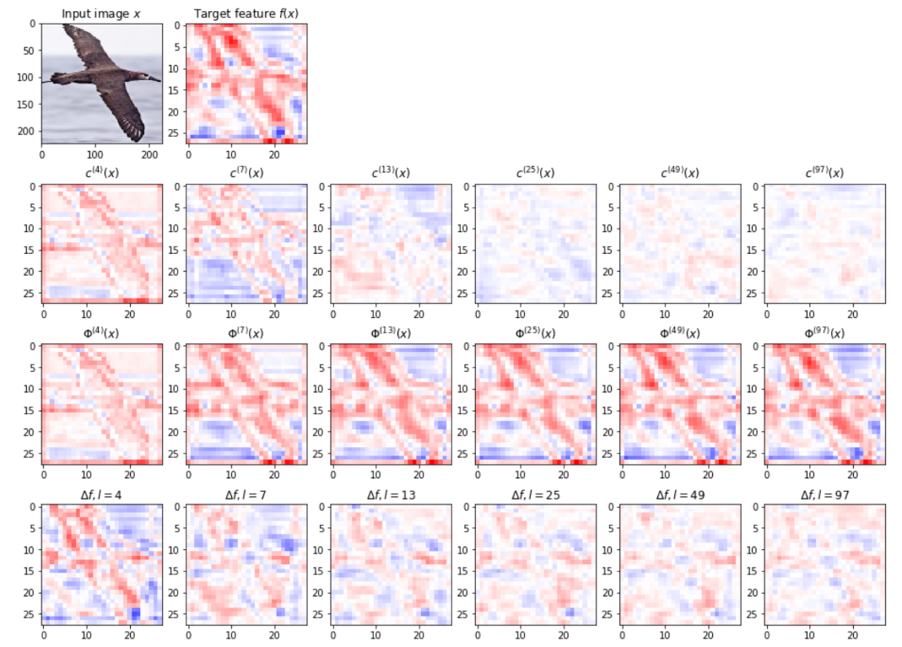

# Interpreting and Disentangling Feature Components of Various Complexity from DNNs

PyTorch implementation of *Interpreting and Disentangling Feature Components of Various Complexity from DNNs* (ICML2021). [pdf](http://proceedings.mlr.press/v139/ren21b/ren21b.pdf)

*We will re-arrange the code for better readability and reusability soon.*

### Environment

- python 3.6
- pytorch==1.2.0

### Dataset

- [x] [CIFAR10](http://www.cs.toronto.edu/~kriz/cifar.html)
- [x] [CUB-200-2011](http://www.vision.caltech.edu/visipedia/CUB-200.html)
- [x] [DOG120](http://vision.stanford.edu/aditya86/ImageNetDogs)

The images in CUB-200-2011 and DOG120 are cropped using the provided bounding boxes. For example, to crop the CUB-200-2011 dataset:

~~~bash
python3 ./dataset/generate_dataset.py --dataset=dogs
~~~

Also, in this paper, datasets of different training samples are needed. For example, to generate a subset of CUB-200-2011 with 2000 training samples:

~~~bash
python3 ./dataset/generate_dataset.py --dataset=cub --data-size=2000
~~~

Note: In our experiments, we used CIFAR10 with 200/500/1000/2000/5000 training samples, CUB-200-2011 with 2000/3000/4000/5000 training samples, and DOG120 with 1200/2400/3600/4800 training samples.

### Train and disentangle

Given the feature of a certain layer in a pretrained DNN, our method 

- [x] disentangles feature components of different complexity orders from the feature
- [x] disentangles reliable feature in the target feature

For example, to train ResNet20 on CIFAR10-2000, and disentangle feature components of different complexity orders and reliable feature:

~~~bash
python3 train_net.py --model-name=resnet20 --data-size=2000 --dataset=cifar10
python3 disentangle.py --model-name=resnet20 --data-size=2000 --dataset=cifar10
python3 disentangle_reliability.py --model-name=resnet20 --data-size=2000 --dataset=cifar10
~~~

### Evaluation

We further design a set of metrics to diagnose the disentangled feature components, including
- [x] the reliability of feature components
- [ ] the effectiveness of feature components (codes will be updated later)
- [ ] the over-fitting level of feature components being over-fitted

Below is an example.

~~~bash
python3 eval_disentangle.py --model-name=resnet20 --data-size=2000 --dataset=cifar10
python3 eval_reliability.py --model-name=resnet20 --data-size=2000 --dataset=cifar10
~~~

### Demos

Several notebooks are provided for visualization demos.

- Visualization of disentangled feature components, feature of different complexity orders, and feature with higher complexity orders *is given in ./visualization_demo/vgg16_conv43_vis.ipynb*

  

- Significance of disentangled feature components, reliability of feature components, effectiveness of feature components, and confidence of feature components being over-fitted *are given in ./vis_demo.ipynb*

  

  *The last two will be updated later.*

- Visualization of relationship between the distribution of feature components and the accuracy *is given in ./vis_demo.ipynb*

  

- Significance of disentangled feature components from the DNNs for different tasks *is given in ./task_complexity/task_complexity_vis.ipynb*

  

